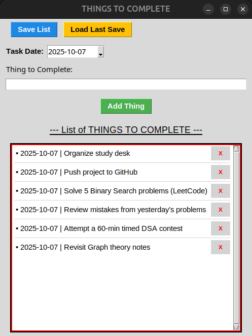

# 🧾 Things To Complete – Python To-Do List App

A lightweight yet polished **To-Do List Manager** built using **Tkinter** and **tkcalendar**.  
It allows you to **add tasks with dates**, **save automatically**, and **reload your last session**, all in a neat scrollable interface.

---

## ✨ Features

✅ Add tasks with a date (via calendar picker)  
✅ Auto-save your progress to JSON  
✅ Load your last saved list on startup  
✅ Delete individual tasks with a single click  
✅ Clean scrollable UI (great for long lists)  
✅ Keyboard shortcut: press **Enter** to add a new task  
✅ Works fully **offline**

---

## 🧠 Code Highlights

- DateEntry (tkcalendar) for intuitive date selection
- Canvas + Scrollbar for smooth scrolling through long task lists
- JSON storage for persistence
- Automatic sorting by date

---

## 📸 Preview



---

## 🧰 Requirements

- Python 3.7 or higher  
- Tkinter (comes pre-installed with Python)  
- [tkcalendar](https://pypi.org/project/tkcalendar/) → install via:
  
  ```bash
  pip install tkcalendar
  ```

---

## 🚀 How to Run

1. Clone or download this repository
2. Open a terminal inside the project folder
3. Run:
```bash
python main.py
```
> Your tasks will be saved in a local file called things_to_complete.json in the same directory.

--- 

## 💡 Future Ideas

- Task editing
- Priority labels (High/Medium/Low)
- Search & filter
- Dark mode toggle
- Export as CSV or PDF

---

## ⚖️ License

This project is licensed under the [MIT License](LICENSE).  
You can freely use, modify, and share it — just keep credit to the original author.

---

## 🧑‍💻 Author

Created by [**Subhanki Sahoo**](https://github.com/subhanki0108)

---

<p align="center">
If you find this project helpful, consider ⭐ starring the repo on GitHub!
</p>
